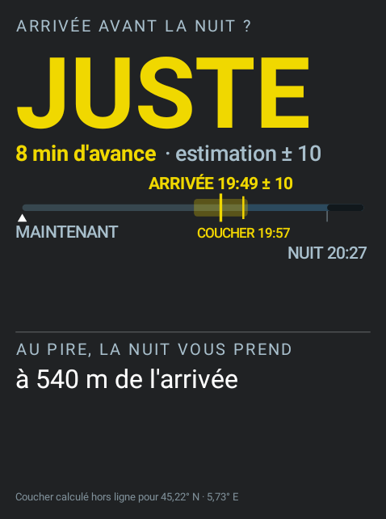

# Champs de données et guidage - Hammerhead Karoo

Extension **Karoo 3** qui enrichit le **guidage d'itinéraire** : elle lit
l'itinéraire chargé dans le Karoo et en tire **onze champs de données** — un tableau de bord
plein écran avec minicarte sur fond de carte embarqué, le profil à venir, la prochaine côte,
le coût du reste en kilojoules, les virages d'une descente, le revêtement, l'espacement des
ravitaillements — et des annonces à l'écran.

Tout est calculé **sur l'appareil**, à partir des données que Karoo OS fournit déjà :
aucune connexion réseau, aucun compte, rien à synchroniser.

**Toutes les images de ce README sortent du rendu de l'appareil.** Elles ne sont pas des
maquettes : le [simulateur](docs/developpement.md#le-simulateur) appelle les mêmes classes que
le champ Karoo, dans le même `Canvas` d'Android, et le CI les régénère à chaque changement
d'affichage. Elles ne peuvent donc pas dériver du code.

Chaque champ est montré à **478 × 642 px**, la place que le Karoo 3 lui accorde réellement.

## Ce que ça ajoute sur le vélo

### Champs de données

| Champ | Type | Contenu |
| --- | --- | --- |
| **Tableau de bord** | graphique, plein écran | Une page tenant tout l'écran : vitesse, cadence et puissance sur 3 secondes, transmission en schéma, fréquence cardiaque, minicarte orientée cap en haut sur fond de carte hors ligne, distance parcourue, distance restante, pente, le verdict « Avant la nuit » sur toute la largeur avec sa frise — heure d'arrivée **avec sa marge**, coucher, nuit — et le profil **à venir** en bandeau. Vitesse, puissance et fréquence cardiaque prennent la couleur de leur zone. Une pression change l'échelle de la carte. |
| **Profil à venir** | graphique | Tout ce qui reste à parcourir, **à échelle comprimée au loin** : la rampe dans trois cents mètres et le col de la fin dans la même bande. Rempli en couleur selon la pente, côtes surlignées avec leur pente moyenne, dénivelé positif restant. |
| **Prochaine côte** | graphique | Avant la côte : distance jusqu'à son pied, longueur, pente moyenne, dénivelé. Dans la côte : distance et dénivelé restants jusqu'au sommet, avec barre de progression. Disponible aussi comme valeur numérique (distance) pour d'autres usages. |
| **Prochain point d'intérêt** | numérique | Distance jusqu'au prochain POI de l'itinéraire (eau, ravitaillement, contrôle…), formatée dans vos unités. |
| **Budget d'effort** | graphique | Ce que coûte le reste, en kilojoules, découpé par poste : le roulant, puis chaque côte. Déduit du temps estimé de chaque poste et de la puissance tenue dans ce régime. La barre porte aussi ce qui est **déjà payé**, que le Karoo intègre de son côté, et la ligne sous elle rapproche la part d'effort de la part de distance. Demande un capteur de puissance. |
| **Virages** | graphique, **pleine page** | Les virages des trois prochains kilomètres sur la route redressée : une barre par virage, longue et rouge selon son rayon. Sur une page, la route se dresse à la verticale — la distance monte, le coureur est en bas. |
| **Suivant la sortie** | graphique | Un champ dont la moitié basse change avec ce que fait la sortie — montée, descente, ravitaillement, roulage — la moitié haute restant fixe. |
| **Revêtement** | graphique, **pleine page** | Route, chemin ou voie verte sur les cinq prochains kilomètres, en posant le tracé sur le fond de carte embarqué, avec la légende des classes rencontrées. |
| **Réserve** | graphique, **pleine page** | Après quel point de ravitaillement il n'y a plus rien. La ligne porte l'itinéraire entier : points passés en gris, prochain en blanc, dernier utile cerclé de jaune, et à sa droite un segment rouge qui ne porte rien. |
| **Autonomie** | graphique, **pleine page** | Les deux réserves qui s'épuisent sur une seule page : la réserve d'eau en haut, le budget d'effort en bas. On ne s'arrête qu'une fois, et c'est en voyant les deux ensemble qu'on décide de s'arrêter à ce point-ci ou de tenir jusqu'au suivant. Demande en outre un capteur de puissance pour sa moitié basse. |
| **Avant la nuit** | graphique, **pleine page** | Arriverez-vous avant le coucher du soleil ? Un mot — **OUI**, **JUSTE**, **NON** — jugé sur la fourchette de l'heure d'arrivée et non sur sa seule moyenne, puis la frise du soir : l'arrivée avec son incertitude, le coucher, la nuit civile. Quand le pire cas ne passe pas, à quelle distance de l'arrivée la nuit vous prendrait. Le coucher est calculé sur l'appareil, depuis votre position, sans réseau. |

Tous s'adaptent à la **taille** que le profil de page leur alloue ; « Prochaine côte » suit en
outre l'**alignement** configuré. Les dix champs graphiques affichent un aperçu réaliste dans
l'écran d'édition des pages — « Prochain point d'intérêt » n'en a pas besoin, c'est le Karoo
qui le dessine.

### À quoi ils ressemblent

Les cinq pleines pages, au même instant de la sortie simulée :

<table>
  <tr>
    <td align="center"> <b>Autonomie</b></td>
    <td align="center"> <b>Avant la nuit</b></td>
    <td align="center"> <b>Réserve</b></td>
    <td align="center"> <b>Virages</b></td>
    <td align="center"> <b>Revêtement</b></td>
  </tr>
</table>

Les champs de bande, qui se posent sur un rang d'une page ordinaire :

<table>
  <tr>
    <td align="center"> <b>Profil à venir</b></td>
    <td align="center"> <b>Suivant la sortie</b></td>
  </tr>
  <tr>
    <td align="center"> <b>Prochaine côte</b></td>
    <td align="center"> <b>Budget d'effort</b></td>
  </tr>
</table>

Et le tableau de bord à ses trois portées de carte, puis avec le profil à la place de la
carte, puis hors itinéraire — le tracé passe au rouge :

<table>
  <tr>
    <td align="center"> 300 m</td>
    <td align="center"> 500 m</td>
    <td align="center"> 1 km</td>
    <td align="center"> Profil</td>
    <td align="center"> Hors itinéraire</td>
  </tr>
</table>

**Huit d'entre eux publient aussi une valeur numérique**, réutilisable dans n'importe quel
champ ou enregistrée dans le fichier de la sortie : la distance au pied ou au sommet
(« Prochaine côte »), au prochain point (« Prochain point d'intérêt »), au virage le plus
serré devant (« Virages »), au prochain changement de sol (« Revêtement ») ; la longueur de
la prochaine traversée sans ravitaillement (« Réserve ») ; les kilojoules restants
(« Budget d'effort », « Autonomie ») ; et l'avance sur le coucher du soleil, en minutes, négative
quand on arrive après (« Avant la nuit »).

Cinq champs sont marqués **pleine page**. Ils fonctionnent posés sur un demi-rang, mais ne
portent pas une valeur : une répartition — les virages d'une descente, les revêtements d'une
portion, l'espacement des ravitaillements — ou un verdict et ce qui le justifie. Réduits à une
bande, il ne leur reste que leurs deux chiffres, ou leur mot, c'est-à-dire ce que les champs
numériques disent déjà. Leur mise en page
change au-delà d'un rapport hauteur/largeur d'un dixième au-dessus du carré.

### L'échelle du profil

Une portée réglable, de un à quinze kilomètres, serait l'aveu d'un choix impossible : à cinq
kilomètres on voit la rampe qui arrive mais plus la journée, à quinze on voit la journée mais
la rampe tient dans deux pixels. Et le choix se poserait en roulant, c'est-à-dire au moment où
l'on ne veut rien régler.

L'échelle horizontale n'est donc pas proportionnelle. La distance est projetée par un
logarithme translaté, fin sur les deux cents premiers mètres et de plus en plus comprimé
ensuite : la bande couvre **tout ce qui reste**, du premier mètre à l'arrivée. Sur cent vingt
kilomètres restants, les deux cents premiers mètres occupent 10,8 % de la largeur et les vingt
derniers kilomètres 2,8 % — le proche pèse quatre fois le lointain.

Cette compression ne se voit pas d'elle-même — un œil qui suppose une échelle régulière lit
un faux relief. Ce sont les graduations sous l'axe qui la disent : leur espacement inégal est
le seul aveu que la bande ne soit pas plate, et c'est pourquoi leurs traits subsistent même
sur un champ trop court pour porter les chiffres.

Le lointain est une **crête** et non une courbe : une colonne de pixels y couvre parfois deux
kilomètres, dont on retient le point le plus haut. Un sommet ne peut donc pas disparaître
entre deux colonnes, mais un col suivi d'une descente courte s'y lit comme un plateau. À cette
échelle, c'est ce qu'on veut savoir.

### L'heure d'arrivée

Celle du Karoo extrapole la moyenne de la sortie, ce qui revient à supposer qu'un col se monte
à la vitesse d'un faux plat : sur un parcours qui garde ses côtes pour la fin, l'heure annoncée
recule de minute en minute.

L'extension en mesure deux, séparément — la vitesse sur terrain roulant en km/h, la vitesse
ascensionnelle en montée en mètres par heure — puis les applique au terrain qui reste, tel que
le profil le décrit : le dénivelé d'un côté, la distance hors montées de l'autre, jamais les
deux pour le même mètre. Les deux allures s'oublient doucement, sur un quart d'heure, car
celle de la sixième heure n'est pas celle de la première.

L'heure porte la marge qu'on reconnaît à l'estimation — « arrivée 19:44 ± 13 » — calculée sur
la régularité observée de chacune des deux allures et sur ce qui reste à faire. Elle se
resserre en approchant. Tant que l'allure n'est pas assez observée, le champ affiche l'heure du
Karoo sans marge : mieux vaut la sienne qu'une heure tirée de trente secondes de roulage.

Sur le tableau de bord, elle s'écrit dans la bande « Avant la nuit », au pied de l'écran, sur
une frise qui la place face au coucher du soleil : c'est à lui qu'on la compare de tête en fin
de journée, et le mot au-dessus — **OUI**, **JUSTE**, **NON** — fait la comparaison à votre
place, sur la fourchette et non sur la seule moyenne. Sans position ni coucher, la bande le
dit ; elle ne cède sa place à rien d'autre, pour que la mise en page ne bouge pas en route.

### Annonces in-ride

Pendant l'enregistrement d'une sortie :

- **Point d'intérêt** — « Fontaine — Dans 500 m »
- **Dernier ravitaillement** — « Lavoir — rien avant 42 km »

Chaque annonce n'est émise qu'une fois par point, et la distance de déclenchement est
réglable.

La seconde est la première retournée. « Prochaine eau dans 500 m » ne dit pas s'il faut s'y
arrêter ; « rien avant 42 km » le dit, et c'est la même donnée. Elle se déclenche sur le
dernier point où l'on peut encore remplir un bidon avant une longue traversée — quinze
kilomètres au moins, sans quoi ce n'en est pas une.

Comptent comme ravitaillement l'eau, les postes de ravitaillement, les épiceries, les
commerces, les stations-service, la restauration, les bars, les cafés et les haltes. Le
contrôle de cyclosportive n'en est pas : il oblige à s'arrêter, mais rien ne dit qu'on y
trouve à boire. Le [réglage](#réglages) « ne compter que les points d'eau » réduit la liste
à l'eau seule, pour qui roule en autonomie complète — et il vaut aussi pour les champs, une
voix qui nommerait un point que l'écran ne montre pas étant pire que pas de voix.

Les côtes n'en déclenchent pas. Une annonce au pied et une avant le sommet couvriraient
l'écran au moment précis où l'on regarde le bandeau de profil pour savoir ce qui reste à
monter. La bande est là en permanence et porte déjà le rang de la côte et la distance au
sommet : l'annonce ne dirait rien de plus, elle le dirait par-dessus.

### Action bonus

L'action **« Annoncer la prochaine côte »** peut être assignée à un bouton de commande
(via les réglages Karoo) pour afficher à la demande le résumé de la côte suivante.

## Réglages

L'application « Guidage » du launcher affiche l'état courant (itinéraire, distance restante,
prochaine côte, prochain point), puis les réglages, rangés par ce qu'ils touchent. Chaque
ligne nomme les champs concernés : un réglage dont on ne sait pas ce qu'il change se laisse
dans son état d'usine, ce qui revient à ne pas l'avoir écrit.

**Tableau de bord**

- minicarte plutôt que profil dans la moitié haute ;
- coloration du profil selon la pente.

**Ravitaillement**

- ne compter que les points d'eau. Décoché — c'est le défaut — commerces, stations-service,
  cafés et haltes comptent aussi. Le choix vaut pour « Réserve », « Autonomie », « Suivant la
  sortie » **et les annonces** : une voix qui nommerait un dernier ravitaillement que l'écran
  ne montre pas serait pire que pas de voix.

**Annonces**

- activation et distance d'annonce des points d'intérêt.

En bas, la carte **« Place allouée au champ »** relève, pour chaque champ posé, les dimensions
que le système lui a réellement accordées — voir
[Développement](docs/developpement.md#la-place-allouée-à-un-champ).

Les changements sont pris en compte immédiatement, sans redémarrer l'extension.

## Installer

C'est le chemin normal, et il ne demande ni ordinateur ni compilation : l'APK est construit
par le CI et publié en Release.

1. Ouvrir **https://github.com/jmallus/guidage-karoo/releases** dans le navigateur du
   **téléphone** — pas du Karoo, qui n'en a pas.
2. Choisir la dernière version `vX.Y.Z`, puis appui long sur le lien `guidage-karoo.apk`.
3. **Partager** le lien vers l'application **Hammerhead Companion**. L'écran d'installation
   s'affiche sur le Karoo.

Après l'installation, les champs apparaissent dans **Profils → une page → ajouter un champ de
données → extension Guidage**.

Le fond de carte voyage **dans** l'APK et se déballe au premier démarrage : rien à copier sur
l'appareil.

Ce chemin ne sert **qu'une fois** : les versions suivantes s'installent depuis le Karoo, par un
appui long sur l'icône de l'extension puis **Mise à jour**.

## Licence et attribution

Le fond de carte embarqué dans l'APK est dérivé de données **OpenStreetMap** :

> © les contributeurs OpenStreetMap — https://www.openstreetmap.org/copyright

Ces données sont sous **ODbL 1.0**. Le fichier `.gkmap` produit par `tools/` en est une base
de données dérivée au sens de cette licence : sa redistribution, y compris à l'intérieur d'un
APK, y reste soumise. Les extraits régionaux viennent de [Geofabrik](https://download.geofabrik.de).

L'attribution est portée en trois endroits, parce qu'aucun ne suffit seul : le fichier
[`NOTICE`](NOTICE), les notes de chaque Release, et le pied de l'écran de réglages de
l'application — le seul que le coureur voie.

Le reste des emprunts — couleurs de zones, contraste APCA, icônes — est détaillé dans le
[`NOTICE`](NOTICE).

## Limites connues

- **Essayée sur un Karoo 3 seulement.** Rien n'y interdit le Karoo 2 — `minSdk 26`, et
  karoo-ext couvre les deux — mais aucun relevé n'en vient : les tailles de champ, la densité
  d'écran et les couleurs ont toutes été mesurées sur un Karoo 3.
- Les champs n'affichent quelque chose qu'avec une **navigation active** : itinéraire chargé
  ou navigation vers un point. Sans navigation, ils indiquent « Pas d'itinéraire ».
- Le profil altimétrique et la liste des côtes sont fournis par Karoo OS depuis karoo-ext 1.1.9 ;
  un Karoo à jour est nécessaire.
- L'heure d'arrivée calculée demande trois minutes de roulage, et deux minutes de montée
  quand il reste du dénivelé. Avant cela — et en l'absence de profil altimétrique — le champ
  affiche celle du Karoo, sans marge.
- En navigation **vers un point** (et non sur un itinéraire enregistré), Karoo ne fournit pas la
  longueur du trajet : elle est déduite du profil altimétrique. Sans profil, la position le long
  du trajet ne peut pas être calculée et les champs restent vides.
- La mise à jour depuis le Karoo suppose une Release publiée (un tag `vX.Y.Z`) : les
  constructions intermédiaires, publiées sous la Release préliminaire `latest`, restent
  invisibles pour l'appareil. C'est voulu.
- Le « Budget d'effort » et la moitié basse d'« Autonomie » demandent un **capteur de
  puissance** et quelques minutes de roulage. Sans eux, rien n'est annoncé — ce qui vaut
  mieux qu'un chiffre inventé. « Revêtement » demande de son côté le fond de carte embarqué.
