# Champs de données et guidage - Hammerhead Karoo

Extension **Karoo 3** qui enrichit le **guidage d'itinéraire** : elle lit
l'itinéraire chargé dans le Karoo et en tire **dix champs de données** — un tableau de bord
plein écran avec minicarte sur fond de carte embarqué, le profil à venir, la prochaine côte,
le coût du reste en kilojoules, les virages d'une descente, le revêtement, l'espacement des
ravitaillements — et des annonces à l'écran.

Tout est calculé **sur l'appareil**, à partir des données que Karoo OS fournit déjà :
aucune connexion réseau, aucun compte, rien à synchroniser.

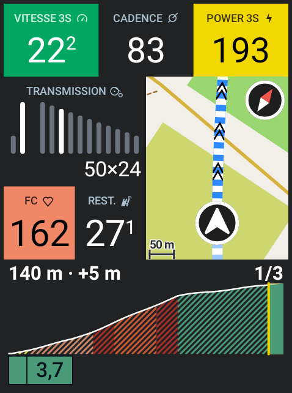

**Toutes les images de ce README sortent du rendu de l'appareil.** Elles ne sont pas des
maquettes : le [simulateur](#le-simulateur) appelle les mêmes classes que le champ Karoo,
dans le même `Canvas` d'Android, et le CI les régénère à la demande dans `docs/captures/`.
Elles ne peuvent donc pas dériver du code — ce qui n'était pas le cas des planches qu'elles
remplacent, dessinées une seconde fois en JavaScript.

Chaque champ est montré à **478 × 642 px**, la place que le Karoo 3 lui accorde réellement.

## Ce que ça ajoute sur le vélo

### Champs de données

| Champ | Type | Contenu |
| --- | --- | --- |
| **Tableau de bord** | graphique, plein écran | Une page tenant tout l'écran : vitesse, cadence et puissance sur 3 secondes, transmission en schéma, fréquence cardiaque, minicarte orientée cap en haut sur fond de carte hors ligne, distance parcourue, pente, distance restante, heure d'arrivée **avec sa marge**, et le profil **à venir** en bandeau. Vitesse, puissance et fréquence cardiaque prennent la couleur de leur zone. Une pression change l'échelle de la carte. |
| **Profil à venir** | graphique | Tout ce qui reste à parcourir, **à échelle comprimée au loin** : la rampe dans trois cents mètres et le col de la fin dans la même bande. Rempli en couleur selon la pente, côtes surlignées avec leur pente moyenne, dénivelé positif restant. |
| **Prochaine côte** | graphique | Avant la côte : distance jusqu'à son pied, longueur, pente moyenne, dénivelé. Dans la côte : distance et dénivelé restants jusqu'au sommet, avec barre de progression. Disponible aussi comme valeur numérique (distance) pour d'autres usages. |
| **Prochain point d'intérêt** | numérique | Distance jusqu'au prochain POI de l'itinéraire (eau, ravitaillement, contrôle…), formatée dans vos unités. |
| **Budget d'effort** | graphique | Ce que coûte le reste, en kilojoules, découpé par poste : le roulant, puis chaque côte. Déduit du temps estimé de chaque poste et de la puissance tenue dans ce régime. La barre porte aussi ce qui est **déjà payé**, que le Karoo intègre de son côté, et la ligne sous elle rapproche la part d'effort de la part de distance. Demande un capteur de puissance. |
| **Virages** | graphique, **pleine page** | Les virages des trois prochains kilomètres sur la route redressée : une barre par virage, longue et rouge selon son rayon. Sur une page, la route se dresse à la verticale — la distance monte, le coureur est en bas. |
| **Suivant la sortie** | graphique | Un champ dont la moitié basse change avec ce que fait la sortie — montée, descente, ravitaillement, roulage — la moitié haute restant fixe. |
| **Revêtement** | graphique, **pleine page** | Route, chemin ou voie verte sur les cinq prochains kilomètres, en posant le tracé sur le fond de carte embarqué, avec la légende des classes rencontrées. |
| **Réserve** | graphique, **pleine page** | Après quel point de ravitaillement il n'y a plus rien. La ligne porte l'itinéraire entier : points passés en gris, prochain en blanc, dernier utile cerclé de jaune, et à sa droite un segment rouge qui ne porte rien. |
| **Autonomie** | graphique, **pleine page** | Les deux réserves qui s'épuisent sur une seule page : la réserve d'eau en haut, le budget d'effort en bas. On ne s'arrête qu'une fois, et c'est en voyant les deux ensemble qu'on décide de s'arrêter à ce point-ci ou de tenir jusqu'au suivant. Demande en outre un capteur de puissance pour sa moitié basse. |

Tous s'adaptent à la **taille** que le profil de page leur alloue ; « Prochaine côte » suit en
outre l'**alignement** configuré. Les neuf champs graphiques affichent un aperçu réaliste dans
l'écran d'édition des pages — « Prochain point d'intérêt » n'en a pas besoin, c'est le Karoo
qui le dessine.

### À quoi ils ressemblent

Les quatre pleines pages, au même instant de la sortie simulée :

<table>
  <tr>
    <td align="center">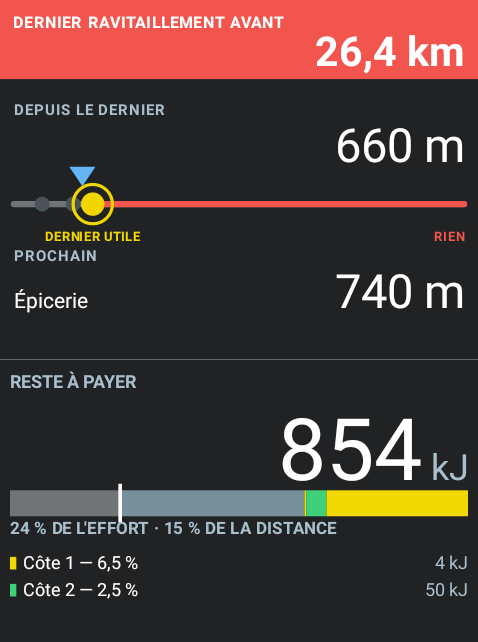<br><b>Autonomie</b></td>
    <td align="center">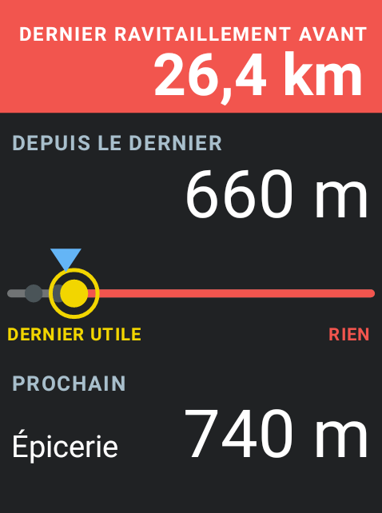<br><b>Réserve</b></td>
    <td align="center">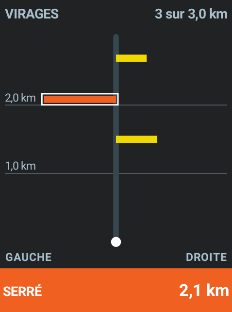<br><b>Virages</b></td>
    <td align="center">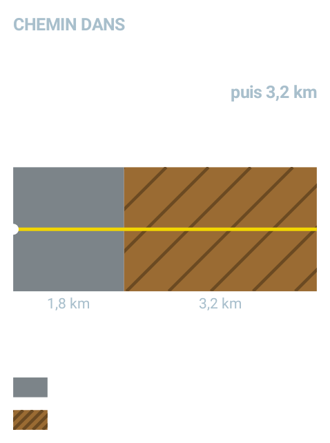<br><b>Revêtement</b></td>
  </tr>
</table>

Les champs de bande, qui se posent sur un rang d'une page ordinaire :

<table>
  <tr>
    <td align="center">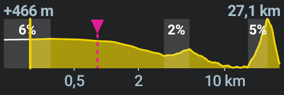<br><b>Profil à venir</b></td>
    <td align="center">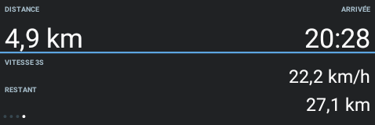<br><b>Suivant la sortie</b></td>
  </tr>
  <tr>
    <td align="center">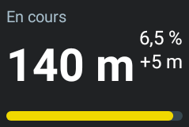<br><b>Prochaine côte</b></td>
    <td align="center"><br><b>Budget d'effort</b></td>
  </tr>
</table>

Et le tableau de bord à ses trois portées de carte, puis avec le profil à la place de la
carte, puis hors itinéraire — le tracé passe au rouge :

<table>
  <tr>
    <td align="center"><br>300 m</td>
    <td align="center">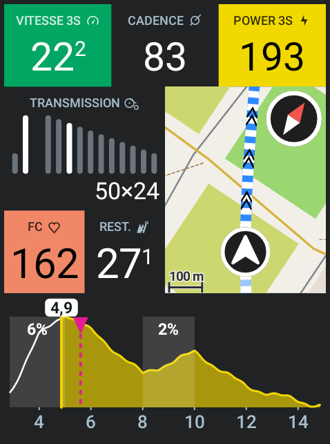<br>500 m</td>
    <td align="center">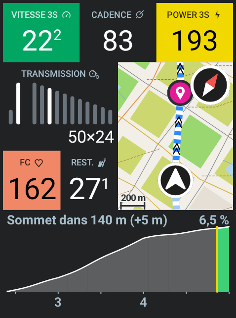<br>1 km</td>
    <td align="center">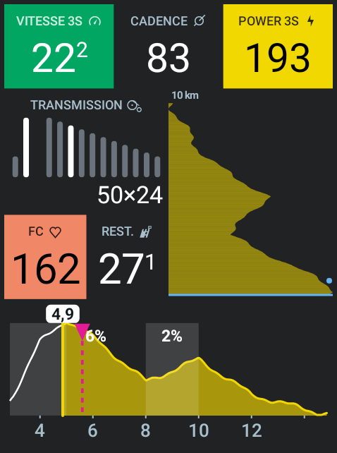<br>Profil</td>
    <td align="center">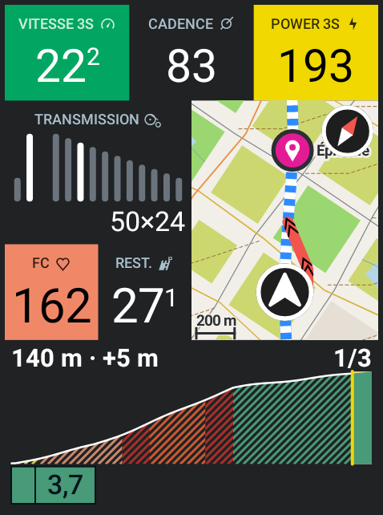<br>Hors itinéraire</td>
  </tr>
</table>

**Sept d'entre eux publient aussi une valeur numérique**, réutilisable dans n'importe quel
champ ou enregistrée dans le fichier de la sortie : la distance au pied ou au sommet
(« Prochaine côte »), au prochain point (« Prochain point d'intérêt »), au virage le plus
serré devant (« Virages »), au prochain changement de sol (« Revêtement ») ; la longueur de
la prochaine traversée sans ravitaillement (« Réserve ») ; et les kilojoules restants
(« Budget d'effort », « Autonomie »).

Quatre champs sont marqués **pleine page**. Ils fonctionnent posés sur un demi-rang, mais ne
portent pas une valeur : une répartition — les virages d'une descente, les revêtements d'une
portion, l'espacement des ravitaillements. Réduits à une bande, il ne leur reste que leurs
deux chiffres, c'est-à-dire ce que les champs numériques disent déjà. Leur mise en page
change au-delà d'un rapport hauteur/largeur d'un dixième au-dessus du carré.

### L'échelle du profil

Le champ « Profil à venir » avait une portée réglable, de un à quinze kilomètres. Ce réglage
était l'aveu d'un choix impossible : à cinq kilomètres on voit la rampe qui arrive mais plus
la journée, à quinze on voit la journée mais la rampe tient dans deux pixels. Et le choix se
pose en roulant, c'est-à-dire au moment où l'on ne veut rien régler.

L'échelle horizontale n'est donc plus proportionnelle. La distance est projetée par un
logarithme translaté, fin sur les deux cents premiers mètres et de plus en plus comprimé
ensuite : la bande couvre **tout ce qui reste**, du premier mètre à l'arrivée. Sur cent vingt
kilomètres restants, les deux cents premiers mètres occupent 10,8 % de la largeur et les vingt
derniers kilomètres 2,8 % — le proche pèse quatre fois le lointain.

Cette compression ne se voit pas d'elle-même — un œil qui suppose une échelle régulière lit
un faux relief. Ce sont les graduations sous l'axe qui la disent : leur espacement inégal est
le seul aveu que la bande ne soit pas plate, et c'est pourquoi leurs traits subsistent même
sur un champ trop court pour porter les chiffres.

Le lointain est une **crête** et non une courbe : une colonne de pixels y couvre parfois deux
kilomètres, dont on retient le point le plus haut. Un sommet ne peut donc pas disparaître
entre deux colonnes, mais un col suivi d'une descente courte s'y lit comme un plateau. À cette
échelle, c'est ce qu'on veut savoir.

### L'heure d'arrivée

Celle du Karoo extrapole la moyenne de la sortie, ce qui revient à supposer qu'un col se monte
à la vitesse d'un faux plat : sur un parcours qui garde ses côtes pour la fin, l'heure annoncée
recule de minute en minute.

L'extension en mesure deux, séparément — la vitesse sur terrain roulant en km/h, la vitesse
ascensionnelle en montée en mètres par heure — puis les applique au terrain qui reste, tel que
le profil le décrit : le dénivelé d'un côté, la distance hors montées de l'autre, jamais les
deux pour le même mètre. Les deux allures s'oublient doucement, sur un quart d'heure, car
celle de la sixième heure n'est pas celle de la première.

Le libellé porte la marge qu'on reconnaît à l'estimation — « ARRIVÉE ± 5 MIN » — calculée sur
la régularité observée de chacune des deux allures et sur ce qui reste à faire. Elle se
resserre en approchant. Tant que l'allure n'est pas assez observée, le champ affiche l'heure du
Karoo sans marge : mieux vaut la sienne qu'une heure tirée de trente secondes de roulage.

### Annonces in-ride

Pendant l'enregistrement d'une sortie :

- **Point d'intérêt** — « Fontaine — Dans 500 m »
- **Dernier ravitaillement** — « Lavoir — rien avant 42 km »

Chaque annonce n'est émise qu'une fois par point, et la distance de déclenchement est
réglable.

La seconde est la première retournée. « Prochaine eau dans 500 m » ne dit pas s'il faut s'y
arrêter ; « rien avant 42 km » le dit, et c'est la même donnée. Elle se déclenche sur le
dernier point où l'on peut encore remplir un bidon avant une longue traversée — quinze
kilomètres au moins, sans quoi ce n'en est pas une.

Comptent comme ravitaillement l'eau, les postes de ravitaillement, les épiceries, les
commerces, les stations-service, la restauration, les bars, les cafés et les haltes. Le
contrôle de cyclosportive n'en est pas : il oblige à s'arrêter, mais rien ne dit qu'on y
trouve à boire. Le [réglage](#réglages) « ne compter que les points d'eau » réduit la liste
à l'eau seule, pour qui roule en autonomie complète — et il vaut aussi pour les champs, une
voix qui nommerait un point que l'écran ne montre pas étant pire que pas de voix.

Les côtes n'en déclenchent plus. Elles en avaient deux — une au pied, une avant le sommet —
qui couvraient l'écran au moment précis où l'on regarde le bandeau de profil pour savoir ce
qui reste à monter. La bande est là en permanence et porte déjà le rang de la côte et la
distance au sommet : l'annonce ne disait rien de plus, elle le disait par-dessus.

### Action bonus

L'action **« Annoncer la prochaine côte »** peut être assignée à un bouton de commande
(via les réglages Karoo) pour afficher à la demande le résumé de la côte suivante.

## Réglages

L'application « Guidage » du launcher affiche l'état courant (itinéraire, distance restante,
prochaine côte, prochain point), puis les réglages, rangés par ce qu'ils touchent. Chaque
ligne nomme les champs concernés : un réglage dont on ne sait pas ce qu'il change se laisse
dans son état d'usine, ce qui revient à ne pas l'avoir écrit.

**Tableau de bord**

- minicarte plutôt que profil dans la moitié haute ;
- coloration du profil selon la pente.

**Ravitaillement**

- ne compter que les points d'eau. Décoché — c'est le défaut — commerces, stations-service,
  cafés et haltes comptent aussi. Le choix vaut pour « Réserve », « Autonomie », « Suivant la
  sortie » **et les annonces** : une voix qui nommerait un dernier ravitaillement que l'écran
  ne montre pas serait pire que pas de voix.

**Annonces**

- activation et distance d'annonce des points d'intérêt.

En bas, la carte **« Place allouée au champ »** relève, pour chaque champ posé, les dimensions
que le système lui a réellement accordées — voir [La taille du champ](#la-taille-du-champ).

Les changements sont pris en compte immédiatement, sans redémarrer l'extension.

## Installer

C'est le chemin normal, et il ne demande ni ordinateur ni compilation : l'APK est construit
par le CI et publié en Release.

1. Ouvrir **https://github.com/jmallus/guidage-karoo/releases** dans le navigateur du
   **téléphone** — pas du Karoo, qui n'en a pas.
2. Choisir la version voulue (voir ci-dessous), puis appui long sur le lien
   `guidage-karoo.apk`.
3. **Partager** le lien vers l'application **Hammerhead Companion**. L'écran d'installation
   s'affiche sur le Karoo.

Après l'installation, les champs apparaissent dans **Profils → une page → ajouter un champ de
données → extension Guidage**.

Le fond de carte voyage **dans** l'APK et se déballe au premier démarrage : rien à copier sur
l'appareil.

### Quelle version prendre

| Release | Ce que c'est |
| --- | --- |
| **`v1.0`, `v1.0.1`, …** | Versions figées, publiées par un tag. Rien ne les écrase. C'est ce qu'il faut prendre pour rouler. |
| **`Guidage — dernière construction`** (`latest`) | La dernière construction, **quelle que soit la branche poussée**. Marquée *pre-release*, réécrite à chaque poussée. Pour essayer un correctif à chaud, pas pour partir en sortie. |
| **`Fond de carte`** (`carte`) | Le `.gkmap` seul, sans l'application. Utile pour vérifier son poids ou le copier à la main ; inutile sinon, puisque l'APK l'embarque déjà. |

Les notes de chaque Release portent le **numéro de version, le commit et la taille du fond de
carte embarqué** : de quoi savoir exactement ce qu'on installe.

### Publier une version

Un tag `vX.Y` déclenche la construction **et** crée la Release versionnée :

```bash
git checkout main && git pull
git tag -a v1.1 -m "Guidage v1.1 — ce qui change"
git push origin v1.1
```

Si la carte doit changer aussi, lancer **d'abord** le workflow `fond-de-carte` et attendre sa
fin : le job `apk` télécharge la carte au début de son exécution, et démarrer trop tôt
embarquerait l'ancienne sans rien signaler.

## Compiler

### Prérequis

- Android Studio (ou le SDK Android en ligne de commande) et un JDK 17+.
- Un jeton GitHub (voir ci-dessous) — nécessaire uniquement pour construire l'APK, pas pour
  lancer les tests du module `:core`.

### Le jeton GitHub (obligatoire)

**Pourquoi.** La bibliothèque `io.hammerhead:karoo-ext` n'est publiée que sur **GitHub
Packages**, dont le registre Maven refuse les requêtes anonymes — *même pour un paquet
public*. C'est une contrainte de GitHub, pas de Hammerhead. Sans jeton, Gradle échoue avec
`Could not resolve io.hammerhead:karoo-ext` (HTTP 401). Le dépôt Maven correspondant est
déjà déclaré dans `settings.gradle.kts` ; il ne manque que vos identifiants.

**Créer le jeton.**

1. github.com → votre avatar → **Settings**
2. tout en bas du menu de gauche → **Developer settings**
3. **Personal access tokens → Tokens (classic)** → *Generate new token (classic)*
4. cochez **uniquement la portée `read:packages`** — rien d'autre n'est utile ici
5. choisissez une expiration (1 an par exemple) et notez la date : la compilation cassera le
   jour où le jeton expirera
6. copiez la valeur `ghp_…` affichée : GitHub ne la remontrera jamais

> Les jetons **fine-grained** (l'autre onglet) ne conviennent pas : ils ne donnent pas accès
> aux paquets d'une autre organisation, et `karoo-ext` appartient à `hammerheadnav`.
> Il faut bien un jeton *classic*.

**Où le déclarer.** Deux emplacements possibles, avec les mêmes deux lignes :

```properties
gpr.user=votre-login-github
gpr.key=ghp_xxxxxxxxxxxxxxxxxxxx
```

- `local.properties`, à la racine du projet — non versionné, déjà listé dans `.gitignore` ;
- `~/.gradle/gradle.properties` — **le plus sûr** : le fichier vit hors du dépôt, il ne *peut*
  structurellement pas partir dans un commit, et il sert à tous vos projets.

> ⛔ **Jamais dans le `gradle.properties` du projet.** Ce fichier-là est versionné : le jeton
> se retrouverait publié au premier `git push`. Le nom ressemble à celui du fichier
> utilisateur, c'est le piège classique — s'il est à la racine du dépôt, ce n'est pas le bon.
>
> Si ça arrive : révoquez immédiatement le jeton sur GitHub (le supprimer du dépôt ne suffit
> pas, il reste consultable dans l'historique), puis regénérez-en un.

À défaut, les variables d'environnement `GITHUB_ACTOR` / `GITHUB_TOKEN` sont utilisées :
c'est ce mécanisme qu'emploie le workflow CI, via les secrets de dépôt `GPR_USER` / `GPR_KEY`
(sans ces secrets, le job de construction de l'APK s'ignore de lui-même).

**Si ça casse.** Un `401 Unauthorized` ou un `Could not resolve io.hammerhead:karoo-ext` au
moment du *sync* signale un jeton absent, mal collé ou expiré. Régénérez-le, recollez-le,
puis relancez avec `./gradlew --refresh-dependencies :app:assembleRelease`.

Ne commitez jamais le jeton : GitHub révoque automatiquement ceux qu'il détecte dans un
dépôt, mais mieux vaut ne pas en arriver là.

### Construire soi-même

```bash
./gradlew :app:assembleRelease
adb install -r app/build/outputs/apk/release/app-release.apk
```

> ⚠️ **Cet APK-là n'embarque pas le fond de carte.** Le téléchargement depuis la Release
> `carte` n'existe que dans le workflow du CI. L'extension fonctionnera, mais la minicarte
> restera vide et affichera « Fond de carte absent ». Pour un APK complet, passer par le CI —
> voir [Installer](#installer).

L'APK release est signé avec la clé `app/guidage.keystore`, versionnée dans le dépôt, pour
pouvoir être installé directement sur le Karoo (mode développeur activé, appareil connecté en
USB ou en ADB Wi-Fi). Cette clé n'a de valeur que tant que le dépôt reste **privé** : elle est
à remplacer avant toute ouverture au public ou diffusion hors de ce dépôt.

Pour reconstruire sans machine, l'onglet **Actions → build → Run workflow** fait le même
travail, fond de carte compris.

### Tests

La logique de guidage — polylignes, profil, côtes, POI, alertes, allure apprise, budget
d'effort, virages, revêtement, réserve, format de fond de carte — vit dans le module `:core`,
sans dépendance Android : elle se teste sans SDK Android, sans appareil et **sans jeton**.

```bash
./gradlew :core:test :tools:test     # 220 tests, aucun prérequis
./gradlew :app:testDebugUnitTest     # 22 tests de plus, sous Robolectric ; demande le jeton
```

Les tests d'`:app` rendent les champs entiers et vérifient qu'à chaque portée la trace se
voit : une compilation ne dirait rien d'un écran noir, qui compile parfaitement. Les 242
tournent à chaque poussée.

## Le simulateur

Avant d'envoyer un APK vers le Karoo, on peut voir le tableau de bord **en mouvement** sur
une machine de bureau. À la racine du dépôt, là où se trouve `gradlew` :

```
./gradlew :app:simulateur
```

Il faut pour cela ce que demande déjà la compilation de l'APK — un JDK 17, le SDK Android et
le [jeton GitHub](#le-jeton-github-obligatoire), puisque `:app` dépend de `karoo-ext` — plus
deux choses : une **session graphique**, la fenêtre étant une fenêtre, et du **réseau au
premier lancement**, Robolectric téléchargeant une fois pour toutes son image d'Android.
Les lancements suivants se passent de réseau.

Le premier prend une minute ou deux : le module se compile, puis les tests de contrôle
passent avant que la fenêtre s'ouvre. C'est voulu — si le rendu est cassé, on l'apprend
avant de le regarder.

Une fenêtre s'ouvre et joue une sortie fictive de trente-deux kilomètres — trois côtes dont
un col, deux descentes, trois points de ravitaillement groupés au début puis vingt-six
kilomètres sans rien — à seize fois la vitesse réelle. La carte défile sous le ruban, la
marque de position glisse dessus et les chevrons filent devant elle, le bandeau de côte
avance, les aplats de zone changent de couleur avec l'effort.

### La taille réelle

La fenêtre s'ouvre à la taille **physique** de l'écran du Karoo 3 — 31,3 mm de large sur
52,2 mm de haut, soit 2,4 pouces de diagonale. C'est tout l'intérêt du banc d'essai :
juger d'un corps de police ou d'une épaisseur de trait sur une image trois fois trop grande
ne dit rien de ce qu'on lira en roulant.

Encore faut-il connaître la densité de l'écran hôte, et **Java ne sait pas la mesurer** :
sur macOS il déclare soixante-douze points au pouce quel que soit l'écran, valeur héritée de
la typographie et sans rapport avec la réalité, qui tourne plutôt autour de 110 à 130 sur un
portable récent. La fenêtre s'ouvre donc à une taille plausible mais fausse tant qu'on ne la
lui a pas dite :

```
./gradlew :app:simulateur -Pguidage.ppp=125
```

Pour trouver la valeur : divisez la largeur de votre écran **en points** (celle que le
système affiche dans ses réglages d'affichage) par sa largeur **en pouces**. Sur un MacBook
Pro 14 pouces en résolution par défaut : 1512 points pour 12,05 pouces, soit 125.

À défaut, la **règle graduée** à gauche de l'image est à la même échelle qu'elle. Posez-y une
vraie règle : si les millimètres coïncident, le tableau de bord est à sa taille physique ;
sinon, `+` et `-` l'ajustent par pas de cinq pour cent, et la ligne du bas affiche la largeur
obtenue.

### La taille du champ

Le champ plein écran n'a pas les 480 × 800 points de l'écran : le Karoo garde une bande de
158 points en haut pour l'heure et la batterie, et un liseré d'un point de chaque côté. La
place réellement laissée, relevée sur un Karoo 3, est de **478 × 642** — soit près d'un
cinquième de la hauteur en moins.

Sur l'appareil la question ne se pose pas : `ViewConfig.viewSize` donne la place allouée et
le rendu s'y ajuste. Le banc d'essai, lui, doit la connaître, et il l'a longtemps ignorée —
il montrait une mise en page plus haute que la vraie : rangs plus espacés, chiffres plus
grands que ce qu'on lira en roulant.

La valeur, 642, est figée dans `Simulateur`, et se change sans recompiler pour un autre
appareil ou un autre gabarit de page :

```
./gradlew :app:simulateur -Pguidage.hauteur=600
```

Pour la relever, **sans rien brancher** : poser le champ **« Tableau de bord »** (dans
le sélecteur, « Guidage » est le nom de l'extension, pas celui du champ) sur une page, ouvrir
cette page une fois, puis lancer l'application Guidage depuis le launcher du Karoo. La carte
« Place allouée au champ », en bas de l'écran de configuration, donne les dimensions telles
que le système les a réellement accordées — pour chaque champ posé, et en séparant l'édition
de la sortie, car rien ne garantit qu'elles coïncident.

Avec `adb`, la même chose se lit au journal :

```bash
adb logcat -s GuidageExtension:D | grep "champ ouvert"
```

Dans les deux cas s'affiche aussi le **corps natif** en sp, celui que le Karoo emploie pour un
champ numérique de cette taille : c'est la référence typographique de l'appareil, plus sûre
que celle d'une maquette.

| Touche | Effet |
| --- | --- |
| **clic** sur l'image | faire tourner la portée de la carte, comme l'appui du doigt sur le champ |
| `espace` | arrêt sur image |
| `←` `→` | reculer / avancer de dix secondes de lecture |
| `↑` `↓` | doubler / diviser la vitesse de lecture |
| `z` | la même chose au clavier — 300 m, 500 m, 1 km |
| `p` | passer de la carte au profil, et retour |
| `h` | simuler la sortie d'itinéraire : le tracé passe au rouge |
| `r` | revenir au départ |
| `+` `-` | ajuster l'échelle par pas de 5 %, la règle en témoin |
| `échap` | quitter |

**Les neuf champs graphiques à la fois.** Les pleines pages d'abord — tableau de bord,
autonomie, réserve, virages, revêtement — puis les champs de bande — profil à venir, suivant
la sortie, prochaine côte, budget d'effort —, en colonnes, tous alimentés par le même instant
de la sortie et tracés **au même facteur**. C'est la seule disposition qui permette de juger des
tailles de texte d'un champ à l'autre : les mettre chacun à sa taille confortable donnerait
des chiffres qui paraissent comparables sans l'être. Le champ « Prochain point d'intérêt »
n'y figure pas — il est numérique, et c'est le Karoo qui le dessine.

Seule la taille du plein écran est un relevé. Celles des autres se déduisent de la grille de
soixante et restent donc des approximations, jusqu'à ce qu'on pose ces champs sur une page et
qu'on lise la carte « Place allouée au champ ».

L'horloge du champ « Suivant la sortie » est celle de la sortie jouée, non celle de la
machine : sa bascule attend qu'un état se confirme, et à seize fois la vitesse réelle une
hystérésis de trois secondes en durerait moins d'une demie.

**Ce qu'il montre est le code de l'appareil.** Ce n'est pas une seconde écriture de
l'affichage : le simulateur assemble l'état d'une sortie, puis appelle les constructeurs de
modèle et les rendus de l'extension — les mêmes classes exactement, dessinant dans le même
`Canvas` d'Android. C'est ce qui le sépare d'une maquette, et c'est pourquoi ses images
servent d'illustration à ce README plutôt qu'un dessin fait à part : un dessin fait à part
dérive, et l'ancien l'a fait.

Le `Canvas` d'Android n'existe pas sur une machine de bureau ; c'est Robolectric qui le
fournit, avec le vrai moteur Skia — mais seulement sous un lanceur de tests. D'où la forme
du simulateur : un test JUnit qui ouvre une fenêtre, et ne l'ouvre que si on la demande.

Ce qu'il ne simule pas : la chaîne karoo-ext elle-même — souscriptions, cadence de
rafraîchissement du système — et la carte hors ligne réelle, remplacée par un décor engendré
autour du coureur. La mise en page, les couleurs, les zones, les chevrons et le bandeau de
côte, eux, sont ceux de l'appareil.

Les mêmes tests tournent **sans fenêtre** à chaque poussée : ils vérifient que chaque portée
dessine bien la trace, ce qu'une compilation ne dirait pas — un écran noir compile très bien.
Les images de contrôle sont écrites dans `app/build/simulateur/`.

### Régénérer les captures

Elles se refont **toutes seules**. Le workflow `captures` part à chaque poussée sur `main` qui
touche ce qui décide de l'affichage — les rendus, les constructeurs de modèle, les libellés,
le parcours d'aperçu, le simulateur. Il exécute les tests du simulateur, range les PNG dans
`docs/captures/` et les commite. Si les images sont identiques à celles du dépôt, il s'arrête
sans rien écrire.

Un changement dans `core/` ou dans le convertisseur de cartes ne déplace aucun pixel et ne le
déclenche donc pas. Au besoin, **Actions → captures → Run workflow** le force à la main.

Le dossier est vidé avant d'être rempli : une capture ne doit pas survivre au champ qu'elle
montrait.

## Architecture

```
core/                        module JVM pur, testable — aucune dépendance Android
  Polyline.kt                décodage des polylignes Google (précision 5 et 1)
  ElevationProfile.kt        profil altimétrique : interpolation, extraction, D+
  Route.kt                   itinéraire, côtes, POI, état de guidage
  Guidance.kt                côte en cours/à venir, prochain POI, fenêtre de profil
  FisheyeScale.kt            l'échelle du profil : fine devant, comprimée au loin
  AlertEngine.kt             décide quelles annonces déclencher, sans répétition
  Pacing.kt                  apprend les deux allures, en déduit l'arrivée et sa marge
  Resupply.kt                la réserve : dernier point avant la prochaine traversée
  EffortBudget.kt            le coût du reste en kilojoules, et le dépensé en regard
  Bends.kt                   les virages lus sur la polyligne, rayon et sens
  RideContext.kt             ce que la sortie fait, et donc ce que le champ montre
  Surfaces.kt                le revêtement, en posant le tracé sur le fond de carte
  Contrast.kt                APCA : encre noire ou blanche sur un aplat de zone
  Format.kt                  formatage distances / dénivelés / pentes (métrique & impérial)
  map/                       le format de fond de carte : écriture, lecture, découpe

tools/                       convertisseur OpenStreetMap, hors de l'APK, exécuté par le CI

app/                         extension Android
  karoo/KarooFlows.kt        ponts callback → Flow de karoo-ext
  karoo/GuidanceProvider.kt  assemble l'état de guidage depuis les événements Karoo
  karoo/RideDataProvider.kt  les relevés chiffrés, et l'allure apprise au fil de la sortie
  extension/                 service d'extension, les dix champs, alertes
  extension/*Models.kt       construisent ce qu'affichent les champs — partagés avec le simulateur
  ui/                        rendu des champs (Canvas + Glance) et écran de réglages
  settings/                  persistance des réglages
  src/test/…/sim/            le simulateur de bureau, hors de l'APK

sim/                         la fenêtre Swing du simulateur, hors de l'APK
```

Les `*Models.kt` d'`extension/` sont la pièce qui tient l'ensemble : le champ Karoo et le
simulateur de bureau appellent **les mêmes**, et il n'existe donc nulle part une seconde
écriture de l'affichage qui pourrait dériver de la première.

### D'où viennent les données

| Donnée | Source Karoo |
| --- | --- |
| Itinéraire, profil, côtes, POI | événement `OnNavigationState` |
| Position sur l'itinéraire | `DISTANCE_TO_DESTINATION` (distance totale − distance restante) |
| Pente instantanée | `ELEVATION_GRADE` |
| Allure du coureur | mesurée en roulant sur `SMOOTHED_3S_AVERAGE_SPEED`, `ELEVATION_GRADE` et `SMOOTHED_3S_AVERAGE_POWER` |
| Effort déjà produit | `ENERGY_OUTPUT`, que le Karoo intègre lui-même |
| Zones et unités du coureur | événement `UserProfile` |
| État de la sortie | événement `RideState` |

## Licence et attribution

Le fond de carte embarqué dans l'APK est dérivé de données **OpenStreetMap** :

> © les contributeurs OpenStreetMap — https://www.openstreetmap.org/copyright

Ces données sont sous **ODbL 1.0**. Le fichier `.gkmap` produit par `tools/` en est une base
de données dérivée au sens de cette licence : sa redistribution, y compris à l'intérieur d'un
APK, y reste soumise. Les extraits régionaux viennent de [Geofabrik](https://download.geofabrik.de).

L'attribution est portée en trois endroits, parce qu'aucun ne suffit seul : le fichier
[`NOTICE`](NOTICE), les notes de chaque Release, et le pied de l'écran de réglages de
l'application — le seul que le coureur voie.

Le reste des emprunts — couleurs de zones, contraste APCA, icônes — est détaillé dans le
[`NOTICE`](NOTICE).

## Limites connues

- **Essayée sur un Karoo 3 seulement.** Rien n'y interdit le Karoo 2 — `minSdk 26`, et
  karoo-ext couvre les deux — mais aucun relevé n'en vient : les tailles de champ, la densité
  d'écran et les couleurs ont toutes été mesurées sur un Karoo 3.
- Les champs n'affichent quelque chose qu'avec une **navigation active** : itinéraire chargé
  ou navigation vers un point. Sans navigation, ils indiquent « Pas d'itinéraire ».
- Le profil altimétrique et la liste des côtes sont fournis par Karoo OS depuis karoo-ext 1.1.9 ;
  un Karoo à jour est nécessaire.
- L'heure d'arrivée calculée demande trois minutes de roulage, et deux minutes de montée
  quand il reste du dénivelé. Avant cela — et en l'absence de profil altimétrique — le champ
  affiche celle du Karoo, sans marge.
- En navigation **vers un point** (et non sur un itinéraire enregistré), Karoo ne fournit pas la
  longueur du trajet : elle est déduite du profil altimétrique. Sans profil, la position le long
  du trajet ne peut pas être calculée et les champs restent vides.
- La clé de signature est versionnée dans le dépôt : acceptable tant qu'il est privé, à
  remplacer avant toute diffusion publique.
- Le « Budget d'effort » et la moitié basse d'« Autonomie » demandent un **capteur de
  puissance** et quelques minutes de roulage. Sans eux, rien n'est annoncé — ce qui vaut
  mieux qu'un chiffre inventé. « Revêtement » demande de son côté le fond de carte embarqué.
