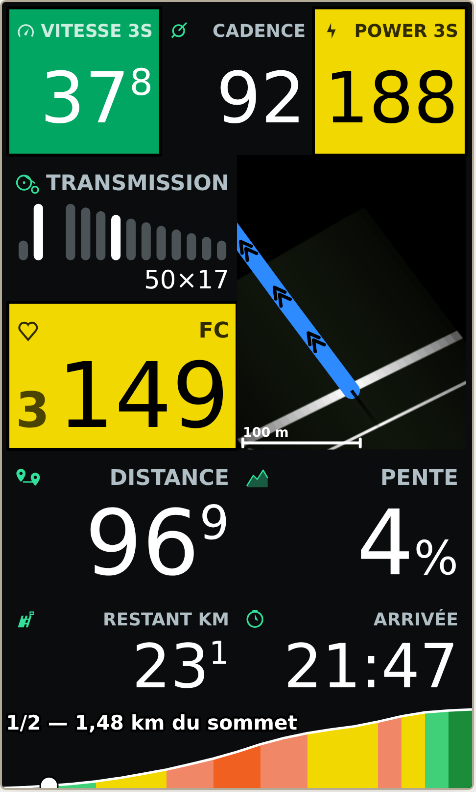
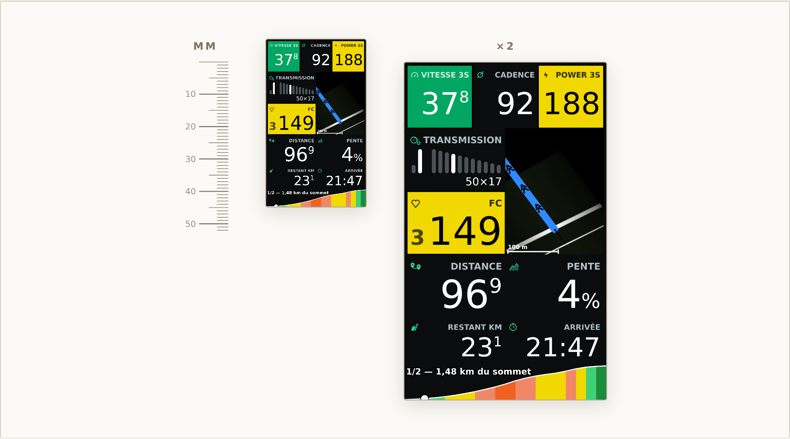
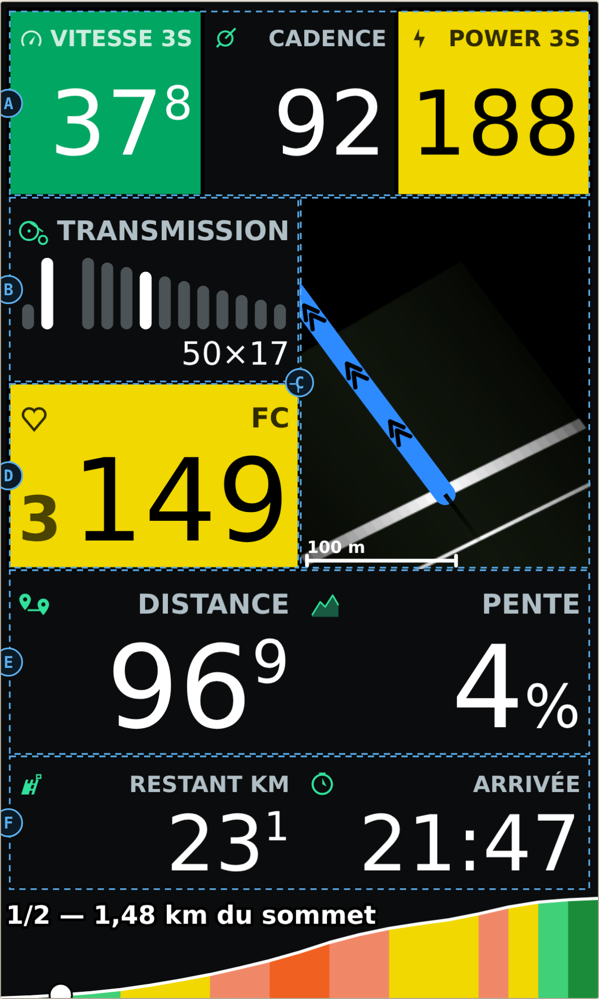
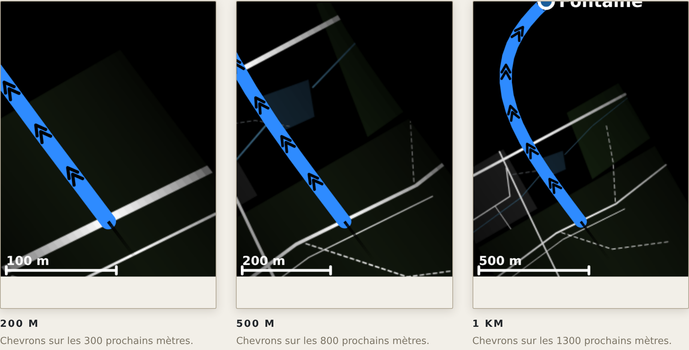
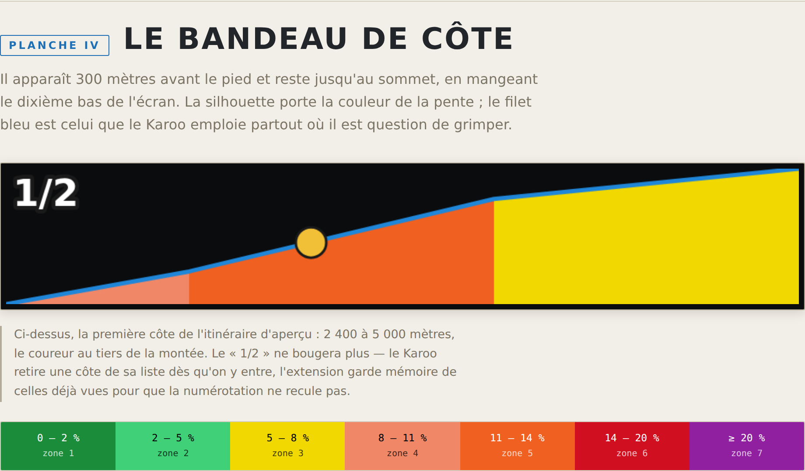
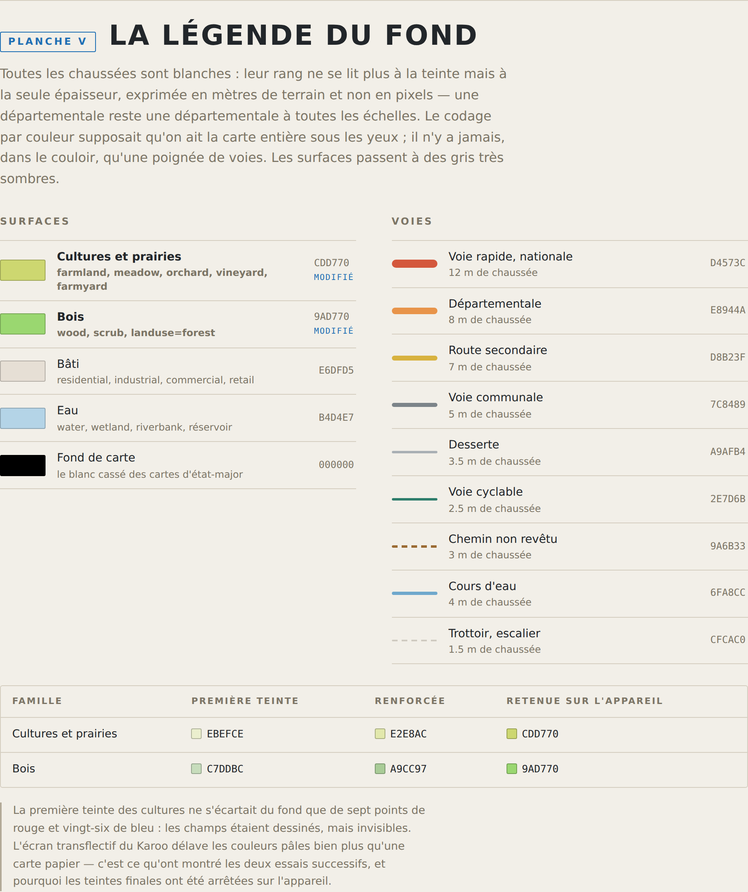

# Les planches

Le tableau de bord, reconstruit à la taille qu'il occupe réellement sur l'écran du Karoo 3 :
480 × 800 points sur deux pouces et demi de diagonale, soit trente et un millimètres de large
et cinquante-deux de haut.

Ces planches servent à juger d'une retouche d'affichage **sans avoir à construire un APK,
l'installer et sortir le vélo** — ce qui prenait jusqu'ici une demi-journée pour un point de
corps de police. Les cotes, les couleurs, les tracés d'icônes et la projection « cap en haut »
sont ceux des sources.

> **Ces images sont un rendu, pas une capture d'écran.** Le dessin est porté en JavaScript
> dans [`planches.html`](planches.html) — écrit une seconde fois, donc. Il ne suit pas tout
> seul les retouches de `DashboardRenderer`, `MapRenderer` ou `RoadStyle` : toute modification
> de l'un demande la même de l'autre. Une seule chose diffère volontairement : le Karoo compose
> en Roboto, plus étroit que la fonte système d'un navigateur, et les libellés — dont le corps
> s'ajuste à la largeur disponible — sortent donc un peu plus petits ici que sur l'appareil.

Version reproduite : **`6e874b8`**.

## La page interactive

[`docs/planches.html`](planches.html) est un fichier autonome : l'ouvrir dans un navigateur
suffit, il ne charge rien d'extérieur. Il apporte deux choses que les images ne peuvent pas
donner :

- **la taille réelle**, en millimètres, avec une règle graduée à côté pour la vérifier contre
  une vraie règle ;
- **l'heure d'arrivée** calculée sur l'horloge de la machine, comme sur l'appareil.

GitHub affiche le source d'un fichier HTML, jamais la page : d'où les images ci-dessous.

## Le tableau de bord



Cinq rangs, dessinés d'un seul tenant sur une toile plutôt qu'assemblés en cases : c'est ce
qui permet à la carte d'occuper deux hauteurs de rang, et au profil de côte de s'insérer en
bas sans déranger le reste.

## Planche I — L'écran, taille réelle



Voilà la surface dont on dispose. C'est cette contrainte-là qui explique tout le reste : les
chiffres alignés à droite, les décimales en exposant, la carte qui n'affiche que ce qui sert à
tourner au bon carrefour.

## Planche II — Ce que porte chaque zone



| | Zone | Ce qu'elle porte |
| --- | --- | --- |
| **A** | Bandeau d'effort | Vitesse, cadence, puissance sur 3 secondes. Vitesse et puissance prennent un aplat : vert au-dessus de la moyenne de la sortie, et la couleur de la zone réglée dans le Karoo. |
| **B** | Transmission | Plateaux à gauche, pignons à droite, même pas d'un peigne à l'autre. Les barres suivent la denture : le peigne des plateaux monte, celui des pignons descend, le rapport n° 1 étant le petit plateau mais le grand pignon. La barre allumée est en blanc — c'est un chiffre qu'on lit, pas un voyant. Un mono-plateau n'affiche que la cassette. |
| **C** | Minicarte | Cap en haut, coureur fixe aux quatre cinquièmes de la hauteur. Fond noir, voies blanches dont le rang se lit à la seule épaisseur, et qui s'éteignent vers le noir en s'écartant de l'itinéraire : la carte ne montre qu'un couloir autour de ce qu'on va faire. Le tracé est un ruban bleu, plein devant le coureur et s'effaçant derrière lui, jalonné de doubles chevrons noirs bornés aux prochaines centaines de mètres. Pas de flèche : le ruban plein dit déjà où l'on est. Le tracé se coupe à l'aplomb du coureur, projeté sur le segment et non sur le sommet le plus proche — sans quoi la coupure attendait le coureur puis sautait au sommet suivant. Hors itinéraire, il passe au rouge. |
| **D** | Fréquence cardiaque | Aplat de zone, encre noire ou blanche selon le contraste perceptuel APCA : le jaune tempo réclame du noir, le rouge anaérobie non. Le numéro de zone est écrit à gauche de la valeur : l'aplat le disait déjà, mais de mémoire seulement — et le saumon de la zone 4 tient de près à l'orange de la zone 5. La place était libre, la valeur étant alignée à droite. |
| **E** | Distance et pente | Une seule taille de chiffres pour ce rang et celui du dessus : sans cela « 96,9 » s'écrirait plus petit que « 4 » et l'œil ne saurait plus laquelle est laquelle. |
| **F** | Fin de parcours | Ce qu'il reste et l'heure d'arrivée estimée — les deux seules valeurs qu'on regarde quand on ne regarde plus rien d'autre. |

## Planche III — Les trois portées



Une pression sur le champ fait tourner l'échelle. Les chevrons ne courent jamais jusqu'au bout
du tracé restant, mais seulement sur les 300, 800 ou 1 300 prochains mètres selon la portée :
sur une boucle qui repasse par son départ, la branche du retour cessait d'indiquer la bonne
direction.

## Planche IV — Le bandeau de côte



Il apparaît 300 mètres avant le pied et reste jusqu'au sommet, en mangeant le dixième bas de
l'écran. La silhouette porte la couleur de la pente ; le filet bleu est celui que le Karoo
emploie partout où il est question de grimper.

## Planche V — La légende du fond



Les surfaces d'abord, de la plus étendue à la plus rare, puis les voies de la plus fine à la
plus large. Les largeurs sont en mètres de terrain, pas en pixels : une départementale reste
une départementale à toutes les échelles.

Les deux verts ont demandé trois essais, et c'est instructif : l'écran transflectif du Karoo
délave les couleurs pâles bien plus qu'une carte papier. Les teintes calquées sur le papier
étaient invisibles sur l'appareil.

| Famille | Première teinte | Renforcée | Retenue sur l'appareil |
| --- | --- | --- | --- |
| Cultures et prairies | `EBEFCE` | `E2E8AC` | `CDD770` |
| Bois | `C7DDBC` | `A9CC97` | `9AD770` |

## Refaire les images

Après toute retouche de `planches.html`, il faut les régénérer et les commiter avec elle,
sinon elles montrent une version que le fichier n'a plus :

```
npm i -D playwright
node docs/rendre-planches.mjs
```

Le script est dans [`rendre-planches.mjs`](rendre-planches.mjs). Il échoue si la page lève une
erreur, plutôt que de produire des images vides.
